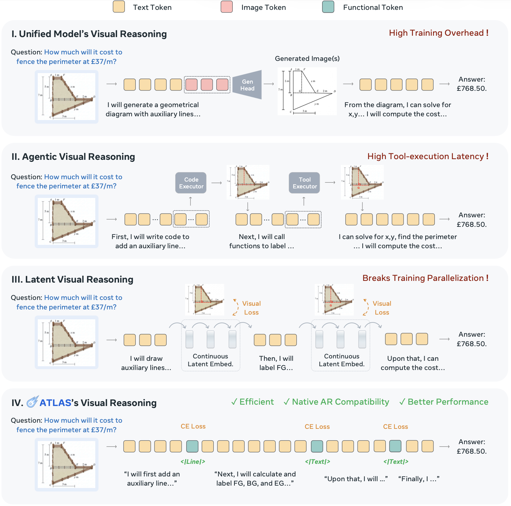
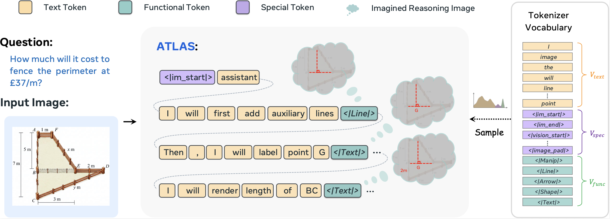
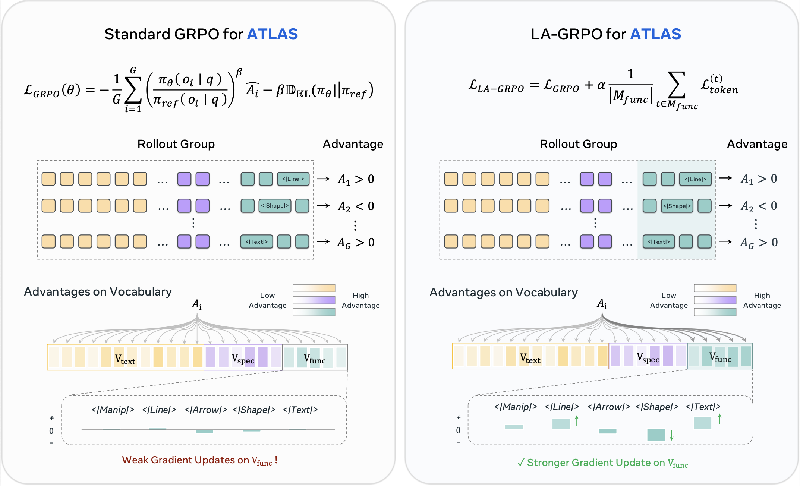
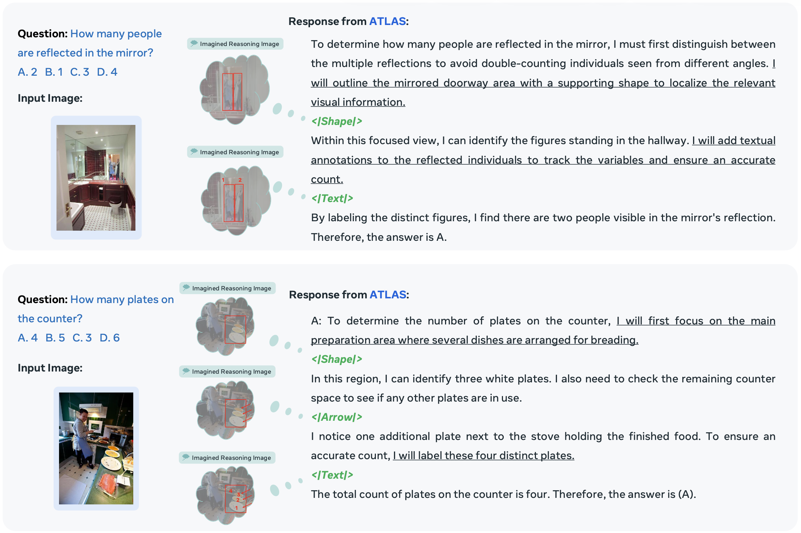

<div align="center">

<h1 align="center">
   ATLAS: Agentic or Latent Visual Reasoning?<br>
  One Word is Enough for Both
</h1>

[Ziyu Guo](https://ziyuguo99.github.io/)<sup>1,2</sup>,
Rain Liu<sup>2</sup>,
[Xinyan Chen](https://xinyan-cxy.github.io/)<sup>1</sup>,
[Pheng Ann Heng](https://www.cse.cuhk.edu.hk/~pheng)<sup>1</sup>

<sup>1</sup>CUHK &nbsp; <sup>2</sup>Meta

Official repository for the paper "[ATLAS](https://atlas-oneword.github.io/)".

[[🌍 Project Page](https://atlas-oneword.github.io/)] [[📖 Paper](https://atlas-oneword.github.io/)] [[🤗 Model](https://atlas-oneword.github.io/)]

</div>

## News

- Code, model, and data release are currently under company review. Coming soon.

## Overview

<p align="center">
  
</p>

## ATLAS

<p align="center">
  
</p>

<p align="center">
  
</p>

## Visualization

<p align="center">
  
</p>

<p align="center">
  
</p>

## Citation

```bibtex
@article{guo2026atlas,
  title   = {ATLAS: Agentic or Latent Visual Reasoning? One Word is Enough for Both},
  author  = {Guo, Ziyu and Liu, Rain and Chen, Xinyan and Heng, Pheng Ann},
  journal = {arXiv preprint},
  year    = {2026}
}
